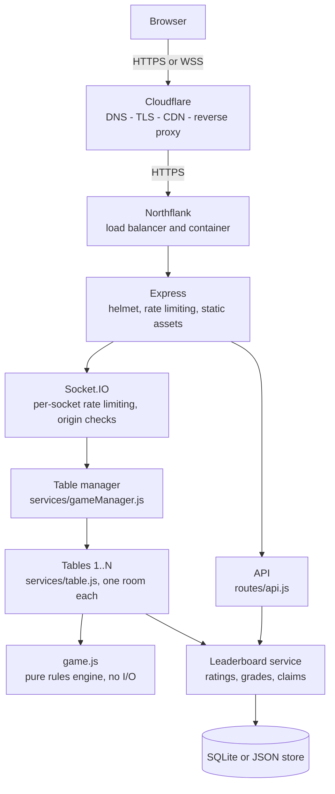
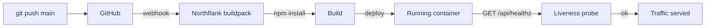
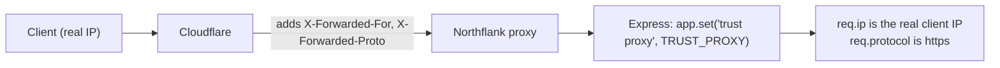
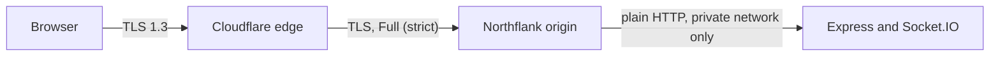
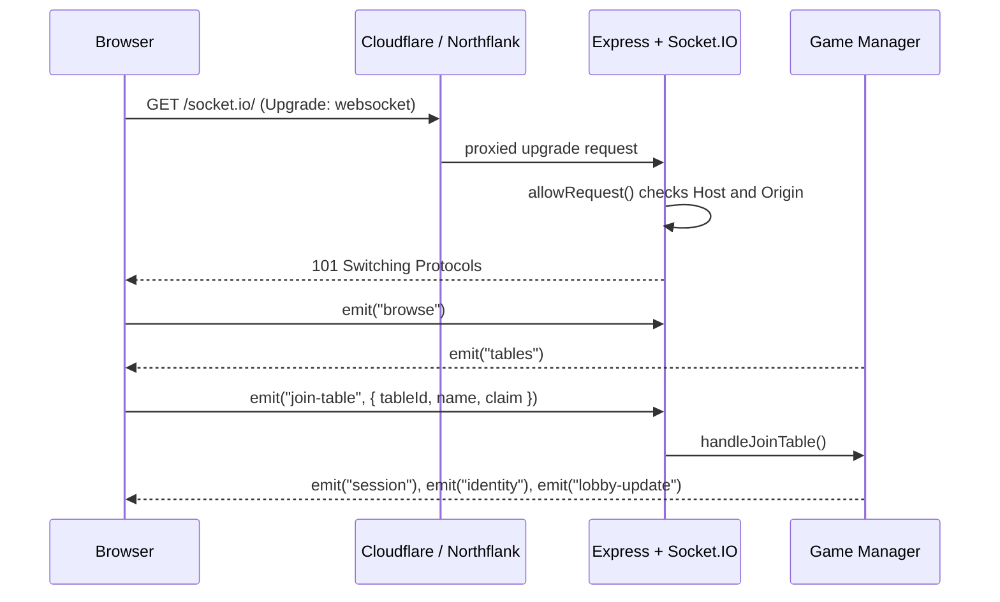
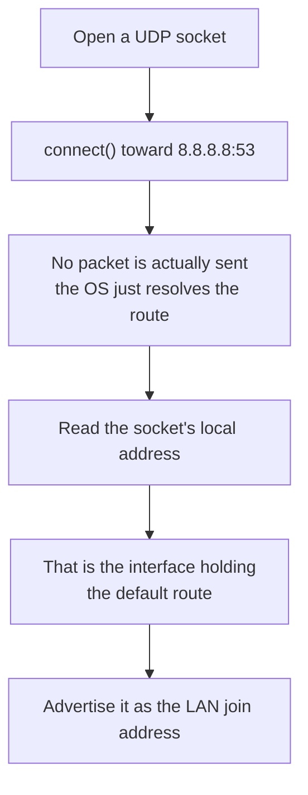
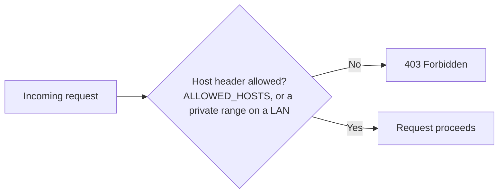
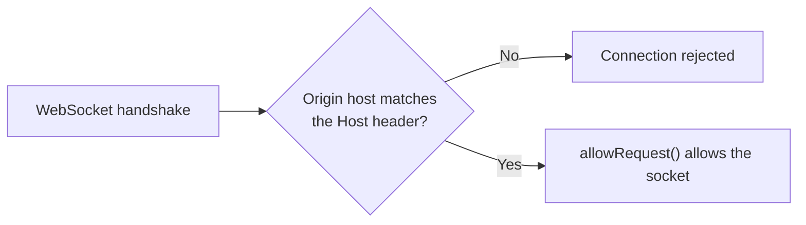

# OMI

A real-time multiplayer web application built to demonstrate networking, security, and
backend engineering, using the traditional Sri Lankan card game Omi as the playable
centerpiece.

Live at **[omi.nodenull.org](https://omi.nodenull.org)**. Built by **Methindu Damsara**
([nodenull.org](https://nodenull.org)).

## Contents

- [What it is](#what-it-is)
- [Skills demonstrated](#skills-demonstrated)
- [Features](#features)
- [Technologies](#technologies)
- [Networking and infrastructure](#networking-and-infrastructure)
- [Screenshots](#screenshots)
- [Quick start](#quick-start)
- [Environment variables](#environment-variables)
- [Deployment](#deployment)
- [Hosting it on your network](#hosting-it-on-your-network)
- [How to play](#how-to-play)
- [Leaderboard](#leaderboard)
- [Database](#database)
- [Security architecture](#security-architecture)
- [How the shuffle stays honest](#how-the-shuffle-stays-honest)
- [Project layout](#project-layout)
- [Testing](#testing)
- [Roadmap](#roadmap)
- [Known limits](#known-limits)
- [License](#license)
- [Troubleshooting](#troubleshooting)

## What it is

OMI is a real-time multiplayer web application built to put networking, security, and
backend engineering practice on display, not only to reimplement a card game. It is a
Node.js + Express + Socket.IO server holding the authoritative game state, paired with a
browser client (plain HTML/CSS/JS, no framework, no build step). The server is split
into focused modules, persistence lives behind its own database layer, and the whole
thing runs continuously deployed behind Cloudflare on Northflank (see
[Networking and infrastructure](#networking-and-infrastructure)).

Underneath the infrastructure, it is also a genuine implementation of **Omi**, the Sri
Lankan trick-taking card game: 2, 3, and 4 player modes, a real persistent physical deck
for the 4 player game, bots filling empty seats, and a shuffle model built on the actual
mathematics of card mixing rather than a perfect randomiser (see
[How the shuffle stays honest](#how-the-shuffle-stays-honest)).

## Skills demonstrated

- **Networking:** HTTP and WebSocket protocols end to end, reverse proxy chains, DNS and
  subdomain routing, TLS termination, proxy header trust (`X-Forwarded-For`,
  `X-Forwarded-Proto`), and OS-level LAN address discovery (see
  [Networking and infrastructure](#networking-and-infrastructure)).
- **Security:** a threat model mapped to CWE and MITRE ATT&CK, a strict
  Content-Security-Policy, Host header and WebSocket origin validation, rate limiting
  and connection caps, and input sanitization against control-character and
  bidirectional-override attacks (see
  [Security architecture](#security-architecture)).
- **Cloud and deployment:** continuous deployment from GitHub, buildpack builds with no
  Dockerfile, a health check endpoint wired to a platform liveness probe, and
  environment-driven configuration across local, LAN, and production (see
  [Deployment](#deployment)).
- **Backend engineering:** an authoritative real-time state machine over Socket.IO, a
  modular service layer, a swappable persistence layer with automatic fallback, and
  three automated test suites covering rules, sockets, and distribution readiness (see
  [Testing](#testing)).

## Features

- **Several tables at once**: the server runs a fixed number of independent tables
  (4 by default). Pick an open one; a table locks once its game starts, and each
  table has its own lobby, deck, chat, and invite link.
- **2, 3, and 4 player modes**, with bots filling any empty seats so you can play solo.
- **A real physical deck** (4 player): you wash, shuffle, and cut the cards by hand, and
  the same 32 cards carry over from round to round. The shuffle is modelled on real card
  mixing rather than a perfect randomiser (see below).
- **Team selection**: the host picks who partners with whom before the game starts.
- **Real table rules**: the trump caller's partner may not look at any cards until trump
  is called, and a hand where either team holds fewer than 2 trumps is thrown in and
  redealt by the same dealer.
- **Table chat**: public table talk that never blocks the cards, with speech bubbles at
  each seat, quick phrases, and per-player mute.
- **Rated leaderboard**: individual Elo-style ratings, a grade for every player in every
  4-player match, and a round-by-round history of who played whom and how it went.
- **Reconnect support**: refresh the page or drop off Wi-Fi and you reclaim your seat
  within a grace window instead of ending the match for everyone. After the match,
  everyone can stay at the table for a rematch.
- **Installable (PWA)**: add it to a phone or desktop home screen; it loads offline.
- **Join by QR code or invite link**, plus a scannable code in the terminal.
- **Responsive and accessible**: adapts from phones to tablets to desktops, with keyboard
  play, focus indicators, ARIA labels, and reduced-motion support.
- **Deploys anywhere**: runs from source, sits behind a reverse proxy over HTTPS, or
  packages to a single-file `omi.exe` for LAN play. The hosted copy at
  [omi.nodenull.org](https://omi.nodenull.org) runs continuously deployed on Northflank
  behind Cloudflare.

## Technologies

- **Runtime:** Node.js 18+, Express, Socket.IO.
- **Security:** helmet, express-rate-limit, compression, a strict Content-Security-Policy.
- **Storage:** SQLite via better-sqlite3, behind a database layer with a JSON fallback.
- **Client:** vanilla HTML/CSS/JavaScript, a service worker, and a web app manifest.
- **Deployment:** Northflank (buildpack builds, continuous delivery from GitHub) behind
  Cloudflare (DNS, TLS, CDN).
- **Tooling:** dotenv for configuration, pkg for the optional Windows executable.

## Networking and infrastructure

### Architecture overview

A request or game action passes through several hops before it reaches the game engine:



Cloudflare terminates the public connection and proxies it to Northflank, which runs the
Node process in a container. Express applies security headers and rate limiting before
anything reaches game logic, and Socket.IO carries the real-time traffic to the table
manager. The manager routes each socket to the table it sits at; every table is an
isolated match with its own Socket.IO room, timers, and persistent deck, and only the
tables ever touch `game.js`, the pure rules engine.

### Cloudflare: DNS, TLS, and the edge

`nodenull.org` is my portfolio site; `omi.nodenull.org` is a subdomain pointed at this
project specifically, so the two stay on separate infrastructure behind one domain.
Cloudflare sits in front of Northflank and handles:

- **DNS:** the `omi` subdomain resolves to Northflank's edge.
- **TLS termination:** Cloudflare holds the public-facing certificate, so browsers see
  valid HTTPS even though the certificate work happens at the edge.
- **CDN:** static assets (CSS, client JS, icons) can be cached at Cloudflare's edge; the
  API and Socket.IO paths are never cached (the service worker on the client follows the
  same rule, see [Project layout](#project-layout)).
- **Reverse proxy:** Cloudflare forwards the request to Northflank over a second,
  separate TLS connection, configured in **Full (strict)** mode, so Cloudflare validates
  Northflank's own certificate rather than trusting whatever the origin presents.

### Northflank: buildpack deploys and continuous delivery

The app deploys straight from this GitHub repository with no Dockerfile. Northflank's
buildpack detects Node.js from `package.json` (the `engines.node` field pins the
version), installs dependencies, and runs `npm start`. Every push to `main` triggers a
rebuild and redeploy automatically:



`GET /api/healthz` (see [Database](#database)) is wired up as Northflank's health check,
so the platform knows to restart the container if the process hangs instead of leaving a
dead instance behind. Environment variables (`NODE_ENV`, `ALLOWED_HOSTS`, `PUBLIC_URL`,
`DATA_DIR`, and so on, see [Environment variables](#environment-variables)) are set in
Northflank's dashboard rather than committed to the repo, and the leaderboard's SQLite
file lives on a persistent volume so it survives redeploys.

### Trusting the reverse proxy

Every request Express sees technically comes from Northflank's internal network, not the
player's browser, so the app has to be told which hops to trust for the real client
address and protocol:



`TRUST_PROXY` (default `1`) tells Express how many proxy hops to trust when reading
`X-Forwarded-For`. Get this wrong in either direction and two things break: rate limiting
keys off the wrong IP (either everyone shares Northflank's IP and gets rate-limited
together, or a spoofed header is trusted blindly), and the app cannot tell whether it is
actually being served over HTTPS.

### TLS end to end



The connection is encrypted from the browser to Cloudflare, and again from Cloudflare to
Northflank; only the last hop, inside Northflank's private network, is plain HTTP. The
server's Content-Security-Policy explicitly allows `wss:` in `connectSrc` (see
`server.js`), so the Socket.IO connection upgrades to a secure WebSocket rather than
falling back to polling.

### The Socket.IO connection lifecycle



The client also sends a protocol version in the handshake; a stale cached copy of the
page is told to reload rather than talk to a newer server with an older event contract.

Every socket gets its own token-bucket rate limiter the moment it connects (see
[Security architecture](#security-architecture)), and `allowRequest` rejects the
handshake outright if the `Host` or `Origin` header does not check out, before a single
game event is processed.

For how the server finds its own address on a local network rather than behind
Cloudflare, see [Hosting it on your network](#hosting-it-on-your-network).

## Screenshots

Add screenshots or a short GIF here to show the lobby, the physical-deck shuffle, a hand
in play, and the leaderboard. Suggested captures:

```
docs/lobby.png        The lobby with the QR code, team panel, and invite link
docs/shuffle.png      Washing / riffling the physical deck
docs/play.png         A four-player hand mid-trick
docs/leaderboard.png  The leaderboard with the top three highlighted
```

(Images are not committed to keep the repository light; drop them in a `docs/` folder
and reference them here.)

## Quick start

Requires Node.js 18 or newer. Install and run:

```bash
npm install
npm start
```

Then open the address it prints (see the next section). That is all: the browser
client ships with the repo, so there is nothing else to copy or configure.

If port 3000 is already taken, pick another one:

```bash
# macOS / Linux
PORT=3001 npm start
# Windows PowerShell
$env:PORT=3001; npm start
```

Build a standalone Windows executable (no Node needed on the machine that runs it):

```bash
npm run build
# or: npx pkg . --targets node18-win-x64 --output omi.exe
```

For local development with auto-restart on file changes:

```bash
npm run dev
```

## Environment variables

Every tunable is read from the environment, so the same build runs on a laptop, a LAN
host, or a public deployment with no code changes. Copy `.env.example` to `.env` for
local use, or set these on your hosting platform. All are optional and have sensible
defaults.

| Variable | Default | Purpose |
| --- | --- | --- |
| `PORT` | `3000` | Port to listen on. |
| `NODE_ENV` | `development` | `production` quiets logs, trusts the proxy for host checks, and skips the LAN QR banner. |
| `ALLOWED_HOSTS` | (empty) | Comma-separated hostnames to answer to. Empty on a LAN (private addresses are allowed automatically); set it in production to lock the server to your domain. |
| `PUBLIC_URL` | (empty) | Public base URL to advertise in join links / QR when deployed behind a proxy. |
| `TRUST_PROXY` | `1` | Proxy hops to trust for the real client IP and protocol. |
| `MAX_SLOTS` | `4` | Number of tables (independent games), 1 to 16. Each seats up to four players. |
| `MAX_SOCKETS` | `MAX_SLOTS*4 + 16` | Maximum simultaneous connections (seated players plus people browsing tables). |
| `GAME_IDLE_MIN` | `5` | Minutes a game waits on one player (turn, shuffle, cut, ready) before it ends. A warning shows a minute earlier. |
| `LOBBY_IDLE_MIN` | `15` | Minutes a table's lobby can sit with no activity before it is cleared. |
| `DB_DRIVER` | `auto` | `auto` uses SQLite when available, otherwise a JSON file. Force with `sqlite` or `json`. |
| `DATA_DIR` | `./data` | Where the leaderboard is stored. Point at a persistent volume in production. |
| `LEADERBOARD_SIZE` | `100` | Most players the leaderboard returns. |
| `LOG_LEVEL` | `info` (prod) / `debug` | `error`, `warn`, `info`, or `debug`. |

## Deployment

The hosted copy at **[omi.nodenull.org](https://omi.nodenull.org)** runs on
**Northflank**, deployed straight from this repository with a buildpack build (no
Dockerfile), behind **Cloudflare** for DNS, TLS, and edge proxying. See
[Networking and infrastructure](#networking-and-infrastructure) for the full request
path and the reasoning behind each piece.

It calls `app.set('trust proxy', ...)`, so it reads the real client IP and protocol from
the proxy chain, and it makes no `localhost`-only assumptions, which is what lets the
same code run unmodified on a laptop, a LAN host, or behind Cloudflare and Northflank.

The production configuration behind the live deployment:

```bash
NODE_ENV=production
PORT=8080                        # or whatever the platform assigns
ALLOWED_HOSTS=omi.nodenull.org
PUBLIC_URL=https://omi.nodenull.org
TRUST_PROXY=1                     # one hop: Northflank's own proxy in front of the container
DATA_DIR=/data                    # a Northflank persistent volume, so scores survive redeploys
```

Notes:

- `ALLOWED_HOSTS` locks the server to this exact hostname; without it, production trusts
  the proxy and answers any host, which is fine on a platform where the proxy already
  filters traffic, but tighter is safer.
- The persistent volume matters: on an ephemeral container filesystem the SQLite file is
  wiped on every redeploy, and the leaderboard would reset (see
  [Database](#database) for the planned fix).
- `MAX_SOCKETS` now scales with `MAX_SLOTS` by default. If the platform pins
  `MAX_SOCKETS=16` explicitly, raise it (the server logs a warning when it is below
  `MAX_SLOTS*4 + 4`) or remove it.
- Sizing: each table holds a few KB of game state, up to 50 chat messages, and at most
  five timers, so 4 tables use well under 1 MB plus the Socket.IO buffers. The busiest
  traffic is the dealer's wash relay (about 20 small messages a second to three
  players). A small instance (0.1 to 0.2 vCPU, 256 MB) handles the default 4 tables;
  raise `MAX_SLOTS` to 8 or so on 0.5 vCPU and up. The database is written once per
  finished match, never per move.
- WebSockets are proxied by both Cloudflare and Northflank by default; the client
  connects over `wss:` automatically once the page itself is served over HTTPS.
- `GET /api/healthz` is wired up as Northflank's health check, so a hung process gets
  restarted instead of serving nobody silently.
- The `omi.exe` build is for LAN play only; the cloud deployment runs the Node process
  directly, not the packaged executable.

To deploy this elsewhere, any platform that runs a long-lived Node process behind HTTPS
works the same way: set `ALLOWED_HOSTS` and `PUBLIC_URL` to your domain, point
`DATA_DIR` at persistent storage, and make sure WebSocket upgrades are allowed through
whatever sits in front of it.

## Hosting it on your network

This is the part I cared about most, since the point is that other people join over
the LAN without any setup.

**Finding the right address.** A lot of dev machines have several network interfaces
(Wi-Fi, Ethernet, plus virtual adapters from VirtualBox, VMware, Hyper-V, WSL, Docker,
and VPN clients). The naive "first non-internal IPv4" trick often picks one of those
virtual adapters, and then the address shown to players is one nobody can actually
reach. To avoid that, the server figures out its address two ways and prefers the more
reliable one:



1. It opens a UDP socket and "connects" it toward a public address. UDP connect sends
   no packets, it just runs the OS routing table, so the local address that comes back
   is the interface holding the default route. That is the one other devices on the
   Wi-Fi actually talk to. This works even with no internet connection.
2. As a fallback it enumerates every interface and scores them, preferring real
   Wi-Fi and Ethernet adapters and common home ranges (192.168.x, 10.x) while pushing
   virtual adapters, link-local (169.254.x), and the VirtualBox host-only range to the
   bottom.

**Joining without typing an IP.** When the host opens the lobby, the screen shows a QR
code generated on the spot. Anyone points their phone camera at it and they are in. The
join link is printed underneath for people who would rather type or paste it, and the
terminal also prints a scannable QR code and the link when the server starts. On some
networks the friendlier `http://<hostname>.local:3000` address (mDNS) works too, so
that is offered as a fallback.

**Firewall.** The first time you run it on Windows, allow Node (or `omi.exe`) through
the firewall on private networks when prompted. Without that, other devices cannot
reach port 3000.

## How to play

The game has a built-in **How to Play** panel (the round `?` button, bottom right of
every screen) written in plain English. The short version:

1. Start the server, then everyone opens the join link or scans the QR code and enters
   a name. Next comes the **tables screen**: pick an open table (or follow a table's own
   invite link, `/?table=N`). The first person at a table is its host. A table locks
   once its game starts; everyone else picks another table.
2. The host picks a mode and starts. In the 4 player mode the lobby also shows a
   TEAMS panel: the host presses **CHANGE PARTNERS** to cycle through the three
   possible pairings until everyone is happy with who plays with whom, and the
   game then seats each pair across from each other.
3. Modes:
   - **2 players (Duel):** 8 cards each plus a draw pile. The pile's top card sets
     trump, and both players draw a fresh card after each trick. Best of 5 rounds.
   - **3 players (Free for All):** 30 cards, 10 tricks a round, every trick is a point,
     first to 25.
   - **4 players (Team Mode):** the full Sri Lankan game with a real persistent deck
     (details below), first team to 10 tokens.
4. Empty seats are played by bots.
5. Follow the suit that was led if you can. Trump beats everything else, otherwise the
   highest card of the led suit wins the trick.

### The 4 player deck and scoring

Deal and play run counter-clockwise, following the standard rules
([pagat.com](https://www.pagat.com/whist/omi.html)). The same 32 cards circulate the
whole game and are never reshuffled by the computer between rounds. A round goes:

1. **Wash:** the dealer drags the pile around to smoosh the cards.
2. **Shuffle:** chop overhand packets off the deck by clicking it, or riffle the two
   halves together, as many times as you like.
3. **Cut:** the opponent to the dealer's left slices the squared stack and restacks it.
4. **Deal 4 and call trump:** the player to the dealer's right gets the first 4 cards
   and picks the trump suit before anyone gets more. While they choose, **the caller's
   partner may not look at any cards**: their hand stays face-down under a red cross
   and "WAIT" until trump is called. (The server does not even send those cards until
   then.) The two opponents can look at their own 4 cards as usual.
5. **Deal 4 more:** hands fill to 8 and the trump caller leads.
   **Redeal rule:** if either team holds fewer than 2 trumps between its two players,
   the hand cannot be played. It is thrown in automatically, nothing is scored, and the
   **same** dealer reshuffles, the **same** opponent cuts, and the **same** player calls
   trump again. With a well-mixed deck this happens on roughly 1 hand in 27.
6. Each trick is gathered face-down in the order it was played. Those piles become next
   round's deck, and the deal passes to the right.

Scores are kept the traditional way, with the 20 unused cards acting as tokens. First
team to capture 10 tokens wins.

| Result | Tokens |
| --- | --- |
| Trump caller's team takes 5 to 7 tricks | +1 to the callers |
| Defenders take 5 to 7 tricks | +2 to the defenders |
| Announced Kapothi, swept all 8 | +3 to the sweepers |
| Announced Kapothi, then lost a trick | +4 to the opponents |
| Unannounced sweep of all 8 | scores as a normal win (+1 or +2) |
| 4 to 4 draw | no tokens, a bonus token waits for the next winners |

**Kapothi** (called *Basthe* in the south) is the all-or-nothing call. After a team
wins the first 6 tricks, the leader decides before the 7th whether to announce it and
play for +3, or stay quiet for the safe +1 or +2.

**Ending early.** Anyone can press **END MATCH EARLY** under the scoreboard. If every
player agrees, the match stops and the highest score wins. Level scores end in a draw.
A single decline cancels the vote.

**After the match.** Everyone chooses **BACK TO TABLE** (stay for a rematch with the
same group) or **LEAVE TABLE**. Once all have chosen, or after a minute, the table
returns to its lobby with whoever stayed.

**Chat.** The 💬 button opens the table chat. It is public table talk: everyone at the
table sees every message, and there is no private team channel. The panel never
covers your hand, and new messages also pop up briefly next to the speaker's seat.
Tap a name to mute that player for yourself.

## Leaderboard

A final score barely varies (the winners almost always finish on 10 to 13), so the
board ranks **individual players by rating** and grades every match instead. It is
reachable from the 🏆 button on the join and tables screens and after a match.

- **Players tab:** rank, rating with the last change, wins and losses, average grade,
  and last game. Tap a player for their recent matches: result, score, partner,
  opponents, grade, and rating change.
- **Recent matches tab:** who played whom, the score, rounds, redeals, and how it ended.
  Tap a match for the round-by-round story: who called trump, which suit, the tricks
  split, what each round scored, and every redeal.

**Rating (Elo for pairs).** A team's strength is the average of its two players'
ratings. After a match each ranked player moves by `K x margin x repeat x (result -
expected)`:

| Part | Value |
| --- | --- |
| Starting rating | 1200 |
| `K` | 40 for a player's first 10 rated games, then 24 |
| margin | 1.0 to 1.5 with the token margin (forfeits use 1.0) |
| repeat | 1, then 0.5, then 0.25 for the same four people again within 24 hours |
| Bots, and humans whose name is not ranked | a fixed 1000 that never moves |

Beating bots therefore pays less and less as a player climbs, so they cannot be farmed.

**Grade (0 to 100, shown as a letter).** For each player: 30 for a win (15 for a draw),
up to 20 for the team's share of the tokens, up to 20 for their own share of the tricks,
up to 15 for making their own trump calls, up to 10 for the team breaking the other
side's calls, plus 5 per Kapothi made and minus 5 per Kapothi broken. Letters: **S** 90+,
**A** 78+, **B** 64+, **C** 50+, **D** 36+, **E** below that, and **F** for leaving
a match.

**What counts.**

| How the match ended | Recorded | Rated |
| --- | --- | --- |
| A team reached 10 tokens | yes | yes |
| Ended by agreement, leader on 5+ tokens, not level | yes | yes |
| Ended by agreement earlier, or level | yes | no |
| A player left (or timed out) after 2+ rounds | yes | yes, as a loss for the leaver's team |
| A player left in the first round | no | no |

Only 4-player matches are recorded, and only when at least one ranked player took part.

**Names and claims.** There are no accounts, so a ranked name is claimed by a random
secret that the browser keeps the first time it plays a ranked match under that name.
Only a SHA-256 hash of the secret is stored, it is compared in constant time, and it is
checked again when each match is recorded. Anyone can still sit down under any name;
they are simply not ranked under a name another browser has claimed, so nobody can
spoil someone else's rating. Generic names such as "Player" or "Guest" are never ranked.
Names are matched case-insensitively and Unicode-normalised, so "Kamal" and "KAMAL"
are the same player. The board is served read-only at `GET /api/leaderboard` and
survives server restarts.

## Database

Persistence lives behind a small database layer in `database/`, so game logic never
touches storage directly and the backend can be swapped later.

- **SQLite** (via `better-sqlite3`) is the default, with three tables: `players`
  (rating, record, grade total, and the claim hash), `matches` (score, how it ended,
  whether it was rated, and the round-by-round timeline as JSON), and `match_players`
  (each seat's line in a match). A match and every rating it moves are written in one
  transaction.
- If a native SQLite build is not available (for example inside the packaged `omi.exe`),
  it automatically falls back to a **JSON file** store (`leaderboard-v2.json`, history
  capped at 2000 matches) with the same interface. Force a backend with
  `DB_DRIVER=sqlite` or `DB_DRIVER=json`.
- The original best-score data (the `scores` table, or `leaderboard.json`) is left
  exactly as it was; the rated board simply starts fresh beside it.
- Moving to PostgreSQL later means writing one more store with the same methods
  (`getPlayer`, `recordMatch`, `topPlayers`, `playerMatches`, `recentMatches`,
  `getMatch`, `countLineupSince`, `counts`, `close`) and selecting it in
  `database/index.js`; nothing above the database layer changes.

**Why this is not the final word on persistence.** SQLite works well for development and
for a platform with a persistent volume attached, which is how the live deployment runs
it today. On a container platform without one, though, a redeploy or a restart wipes an
ephemeral filesystem and the leaderboard resets, since there is nothing durable
underneath the database file itself. The next planned step is a store backed by
**Turso** (distributed SQLite over libSQL), which keeps the same interface and the
same SQL, but replaces the local file with a durable,
replicated database, so the leaderboard survives container recreation without needing a
volume at all.

`GET /api/healthz` returns a small JSON health check for platform probes. The other
read-only endpoints are `GET /api/tables` (live table summaries), `GET /api/stats`,
`GET /api/players/:name/matches`, `GET /api/matches`, and `GET /api/matches/:id`.

## Security architecture

The server is meant to run on a private Wi-Fi network as well as behind Cloudflare in
production, so I threat-modelled it for both settings and mapped each control to a known
weakness class. Weaknesses are referenced by
[MITRE CWE](https://cwe.mitre.org) ID, attacker techniques by
[MITRE ATT&CK](https://attack.mitre.org), and dependency issues by CVSS score and
GitHub Security Advisory (GHSA) ID.

| Risk | What could go wrong | Control | Reference |
| --- | --- | --- | --- |
| DNS rebinding | A malicious web page resolves its own domain to your LAN IP and scripts requests to the server | `Host` header allowlist: on a LAN only localhost and RFC 1918 private ranges are served; in production it honours `ALLOWED_HOSTS`. Everything else gets 403 | CWE-350, CWE-346 |
| Cross-site WebSocket hijacking | Raw WebSockets ignore CORS, so another site could open a socket to the game | Same-origin handshake in `allowRequest`, foreign `Origin` rejected at connect | CWE-1385, CWE-346 |
| Event flooding and resource exhaustion | A client spams messages or HTTP requests to pin the CPU or exhaust memory | Per-socket token bucket (about 20 events/s), 16 connection cap, 100 KB socket payload cap, persistent flooders dropped, plus per-IP HTTP rate limiting (`express-rate-limit`) and a 16 KB request-body cap | CWE-400, CWE-770, ATT&CK T1499 |
| Slow-request holding (Slowloris) | Half-open requests held to tie up the server | `headersTimeout` and `requestTimeout` trim slow windows | CWE-400, ATT&CK T1499.001 |
| Malicious input in names | Control, zero-width, or bidirectional-override characters used to spoof or corrupt display (the Trojan Source class, CVE-2021-42574) | Names are stripped to printable characters before use | CWE-20, CWE-1007 |
| Client-side cheating | A modified client tries to peek at hands or act out of turn | Server is authoritative, every action is validated, and a player is only ever sent their own hand. The trump caller's partner is not even sent their own hand until trump is called, including after a reconnect | CWE-602, CWE-359 |
| Cross-table leakage | One table's events reach players at another | Every table has its own Socket.IO room; relays, chat, and notices are sent to that room only, and integration tests assert nothing crosses over | CWE-200 |
| Table hogging | An idle or abandoned game holds one of the fixed tables forever | One seat per socket; an idle reaper ends a game stuck on one player for `GAME_IDLE_MIN` (after a warning) and clears a quiet lobby after `LOBBY_IDLE_MIN` | CWE-400 |
| Chat abuse | Spam, script injection, or bidi/zero-width tricks in messages | Server strips control, zero-width and bidi characters, collapses whitespace, caps at 200 characters, rate limits each player (survives reconnects), and the client renders text only, never HTML. Chat is never stored or logged | CWE-79, CWE-20, CWE-770 |
| Leaderboard manipulation | Playing under someone's name to tank their rating, rage-quitting to dodge a loss, farming bots or alt lineups | Browser-held name claims (SHA-256 hash, constant-time compare, re-checked at record time); leaving after 2 rounds is a rated loss; bots fixed at 1000; repeat lineups count less; early vote ends only rated from 5 tokens | CWE-287, CWE-841 |
| Clickjacking and MIME sniffing | The page framed by a hostile site, or responses reinterpreted as script | Headers set with **helmet**: `X-Frame-Options: DENY`, `frame-ancestors 'none'`, `X-Content-Type-Options: nosniff`, a strict Content-Security-Policy with no inline scripts, and a locked-down Permissions-Policy | CWE-1021, CWE-16 |
| Leaderboard input | A name crafted to inject or corrupt display, or a malformed API query | Names are sanitized the same way as player names and keyed after Unicode normalisation; match ids and limits are validated, and every value is rendered as text | CWE-20 |

Two of these controls are worth walking through, since they are the ones that decide
whether a request reaches the game at all:

**Host header validation** stops DNS rebinding: a malicious page could resolve its own
domain to your LAN IP and then script requests straight at the server. Every request is
checked before anything else runs:



**WebSocket origin validation** stops cross-site WebSocket hijacking: raw WebSockets
ignore CORS, so without this check any page on the internet could open a socket
straight into the game.



**What Helmet actually turns on:**

- `X-Frame-Options: DENY` and `frame-ancestors 'none'`: stops the page from being framed
  by another site (clickjacking).
- A strict Content-Security-Policy with no `unsafe-inline` scripts: the main defense
  against injected script execution (XSS), since a script tag from anywhere but this
  origin simply will not run.
- `X-Content-Type-Options: nosniff`: stops the browser from reinterpreting a response as
  a different content type than the one declared.
- A locked-down Permissions-Policy: disables browser features (camera, microphone,
  geolocation, and so on) the app never uses, so a compromised script has nothing extra
  to reach for.

Responses are also **gzip-compressed** (`compression`) and the framework banner is
suppressed (`x-powered-by` disabled), so nothing about the stack is advertised.

**Dependencies.** The runtime set stays small (express, socket.io, helmet,
express-rate-limit, compression, better-sqlite3, dotenv, chalk, and two QR helpers) and
is scanned with `npm audit`, which draws on the GitHub Advisory Database. The runtime
packages carry no known CVEs.
The one advisory that shows up is [GHSA-22r3-9w55-cj54](https://github.com/advisories/GHSA-22r3-9w55-cj54)
in `pkg`, a **build-time only** tool: a local privilege escalation (CWE-276, CVSS 6.6,
local vector) that never ships to players and only matters on the machine that compiles
the executable, so build on a machine you trust.

**How it was checked.** The header, host, and origin filtering, the 404 behaviour, a
real socket join, and malformed-input survival are all asserted by the automated
`npm run test:dist` suite against a live server. The `test-sockets.js` suite adds
duplicate-join, reconnect, and cleanup coverage, and a `socket.io-client` flood test
confirms a flooding socket is dropped while a well-behaved client keeps playing.

On a LAN the private-host allowlist keeps this safe without extra configuration. In
production, `ALLOWED_HOSTS` is set to `omi.nodenull.org` and the app sits behind
Cloudflare and Northflank's own network protections (see
[Networking and infrastructure](#networking-and-infrastructure)).

## How the shuffle stays honest

A normal `Math.random` shuffle is a perfect randomiser, which would quietly erase the
whole point of a persistent physical deck. Instead the mixing is modelled on how cards
actually behave, using the standard results from the mathematics of card shuffling:

- Riffles follow the Gilbert-Shannon-Reeds model (cut near the middle on a binomial
  split, then interleave with probability proportional to each half's remaining size).
  By the Bayer-Diaconis result, a deck needs roughly seven good riffles to fully mix, so
  a couple of lazy riffles leave real structure behind.
- Overhand chops just reverse packet order, which barely mixes, exactly like the real
  move.
- A short wash only partially stirs the pile.

The upshot is that if players shuffle lazily, runs of cards from last round's tricks
survive into the next deal, just like at a real table, and thorough shuffling genuinely
randomises. The human wash also feeds real entropy into the process: cursor coordinates
and timings seed the generator, so no two shuffles play out the same.

## Project layout

```
server.js                     Entry point: Express, security, routes, Socket.IO wiring
game.js                       Pure game rules and the shuffle model, no I/O
config/index.js               Environment-driven configuration
utils/
  logger.js                   Leveled logger
  network.js                  LAN address detection, host/origin checks, join URL/QR
  sanitize.js                 Shared name sanitization
routes/
  api.js                      HTTP API (/api/leaderboard, /api/stats, /api/health)
services/
  gameManager.js              Table manager: socket routing, tables list, idle reaper
  table.js                    One table: lobby, round flow, reconnect, bots, results
  chat.js                     Chat message cleaning, history, and rate limiting
  rating.js                   Elo ratings, match grades, what counts (pure)
  identity.js                 Name claims (secret, hash, constant-time verify)
  leaderboardService.js       Records matches, moves ratings, shapes the API views
database/
  index.js                    Store factory (SQLite, JSON fallback)
  sqliteStore.js              SQLite backend (players, matches, match_players)
  jsonStore.js                Portable JSON-file backend with the same interface
public/
  index.html                  Client markup shell
  css/styles.css              Client styles
  js/app.js                   Client logic (tables, lobby, game, results)
  js/chat.js                  Table chat panel and speech bubbles
  js/leaderboard.js           Leaderboard overlay (players, matches, timeline)
  sw.js                       Service worker (offline / installable)
  manifest.webmanifest        Web app manifest
  favicon.ico                 Multi-size browser-tab icon (16/32/48)
  icons/                      App icons (SVG + raster), favicon, and the social-preview image
  404.html, 500.html          Themed error pages
  socket.io.min.js            Socket.IO browser client, vendored with the repo
test.js                       Game rules, redeal, and shuffle-model unit tests
test-rating.js                Rating, grade, and name-claim unit tests
test-leaderboard.js           Leaderboard tests, run against SQLite and JSON
test-sockets.js               Socket integration tests (tables, chat, partner wait, ...)
test-dist.js                  Distribution + live-server checks (npm run test:dist)
.env.example                  Documented environment variables
```

## Testing

```bash
npm test            # game rules, shuffle model, leaderboard, and socket behaviour
npm run test:dist   # required files, package contract, assets, security headers,
                    # and a live-server smoke test (join, API, malformed input)
```

`npm test` runs four suites:

- **Game and shuffle** (`test.js`): trick resolution, every scoring case (including the
  Kapothi variant and draw carry-over), the redeal rule (stacked short-trump deals, the
  same roles afterwards, no score, and "redeal if and only if a team is short" over
  1000 random deals), the match log, deck persistence across rounds, the statistical
  properties of the riffle and overhand models, and full bot games in all three modes.
- **Ratings** (`test-rating.js`): expected scores, K, margin and repeat factors, bots
  fixed at 1000, farming limits, what counts, per-player statistics, grades, and name
  claims.
- **Leaderboard** (`test-leaderboard.js`): records real bot-played matches through both
  the SQLite and JSON stores: ratings, grades, claims (including forgeries caught at
  record time), vote and forfeit rules, history and match timelines, persistence across
  a reload, and that legacy data is untouched.
- **Sockets** (`test-sockets.js`): tables (isolation, locking, leaving, rematch),
  chat (scoping, cleaning, rate limits, history), the partner wait (including across a
  reconnect), identity, duplicate-join prevention, malformed-packet survival, reconnect,
  version handshake, and the idle reaper.

## Roadmap

The structure is deliberately loose so features can be added without rewrites. The
database layer, service layer, and API routes are the natural seams for what comes next:

- **Turso-backed leaderboard storage**, so the live deployment survives container
  recreation without depending on a persistent volume (see [Database](#database)).
- **Accounts and authentication**, friends, and player profiles.
- **Match history and richer statistics** (the `/api/stats` endpoint is the starting point).
- **Achievements and cosmetics**.
- **Global and season rankings** built on the same leaderboard store, or a PostgreSQL one.
- **Spectator mode** (watch a game at a locked table without taking a seat).
- **Proper accounts** to replace browser-held name claims, so a ranked name can move
  between devices.
- **Admin tools** over the API layer.

## License

This project is source-available, not open source: the code is here to read, clone, and
run locally for evaluation, but redistribution, commercial use, and public redeployment
are reserved. See [LICENSE](LICENSE) for the exact terms. If you would like to use part
of this project elsewhere, reach out through [nodenull.org](https://nodenull.org).

## Known limits

- A ranked name is tied to the browser that claimed it (clearing site data or
  switching devices loses it); accounts are on the roadmap.
- Chat has no word filter: a naive one fails across Sinhala, Tamil, and English. Each
  player can mute anyone for themselves.
- There is no per-IP limit on seats: behind Cloudflare many real players share edge
  addresses. One seat per connection and the idle reaper keep tables from being held.

## Troubleshooting

- **To stop the server:** press Ctrl+C in its terminal. For the packaged `omi.exe`, end
  it from Task Manager or run `taskkill /F /IM omi.exe`. Stopping ends the match for
  everyone.
- **Port already in use:** another copy is probably still running. Stop it, or start on
  another port with `PORT=3001 npm start`. The server prints a clear message instead of
  crashing silently.
- **Players cannot connect (LAN):** confirm everyone is on the same Wi-Fi, that Node (or
  `omi.exe`) is allowed through the firewall on private networks, and that they use the
  network link, not `localhost`.
- **Leaderboard resets after redeploy:** point `DATA_DIR` at a persistent volume;
  ephemeral filesystems wipe the SQLite file on redeploy.
- **"The server is full":** raise `MAX_SOCKETS` (or unset it so it follows `MAX_SLOTS`).
- **My games are "not ranked":** use your own name (generic ones are never ranked), and
  play from the browser that first claimed it.
